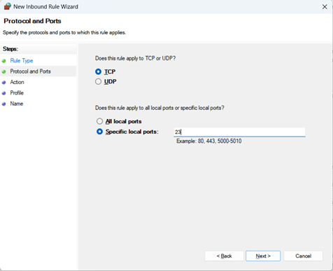

# Task 4: Setup and Use a Firewall on Windows

## Objective
Configure and test basic firewall rules to allow or block traffic on a Windows system.

---

## Tools Used
- Windows Defender Firewall
- ncat (Netcat) for testing port connectivity

---

## Contents

### Firewall Status

- 

### Inbound Rules

- 
- Rules file: [`rules/inbound.txt`](rules/inbound.txt)

### Outbound Rules

- 
- Rules file: [`rules/outbound.txt`](rules/outbound.txt)

### Blocking Port 23 (Telnet)

- 
- 
- 
- 
- 

### Updated Inbound Rules

- 

### After Blocking Telnet

- 

### Restoring Original State

- 

### After Restoring Original State

- 

---

## Video Demonstration

- [`Telnet checking.mkv`](Telnet%20checking.mkv)  
  A video walkthrough demonstrating the firewall behavior when Telnet port is Unblocked.

---

## Summary: How Firewall Filters Traffic

1. **Inspects Each Packet:**  
   Every data packet trying to enter or leave your system is analyzed.

2. **Matches Against Rules:**  
   The firewall checks if the packet matches any allow or block rules you've configured (e.g., block port 23, allow port 22).

3. **Decision Made:**  
   - If a packet matches an **allow** rule, it is permitted through.  
   - If it matches a **block** rule, it is dropped (ignored).

4. **Default Behavior:**  
   If no rule matches, most firewalls follow a **default deny** policy—blocking everything not explicitly allowed.

