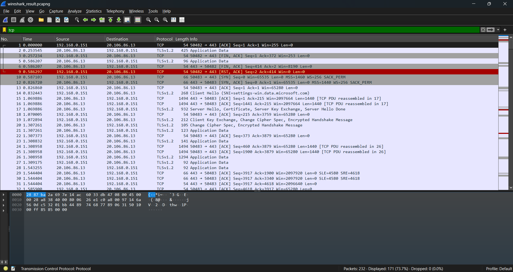

# Task 5: Capture and Analyze Network Traffic Using Wireshark.

## Objective
Capture live network packets and identify basic protocols and traffic types.

---

## Tools Used
- [Wireshark](https://www.wireshark.org/)

---
## Contents

### WIRESHARK RESULT

- 
- Result: [`Capture/result.pcapng`](Capture/result.pcapn)

### COMMANDS USED
```bash
ping google.com
ping youtube.com
```
- 

### FILTER BY HTTP (No Packets since only pinged youtube.com and google.com)

- 

### FILTER BY DNS (12 Packets i.e. 5.2% of result captured)

- 

### FILTER BY TCP (171 Packets i.e. 73.7% of result captured)

- 

### FILTER BY UDP (43 Packets i.e. 18.5% of result captured)

- 

### FILTER BY SSDP (27 Packets i.e. 11.6% of result captured)

- 

### PROTOCOLS SUCCESSFULLY IDENTIFIED

- TCP
- UDP
- DNS
- SSDP

### SUMMARY
- A significant portion of the traffic involved communication with 23.212.160.122, which resolved to a domain related to Microsoft's content delivery network via Akamai. This included typical TLS handshake sequences: Client Hello, Server Hello, certificate exchange, and session establishment followed by Application Data.

- Around packet 201, I noted a TCP FIN, ACK indicating session termination from another external IP (52.167.163.114), possibly from a different completed connection.

- Another complete TLS handshake sequence was observed starting at packet 216, where a new connection was initiated to the same IP. The session proceeded successfully, and application data was exchanged securely.

- I also saw SSDP (Simple Service Discovery Protocol) messages being broadcast from my router (192.168.1.1) to the multicast address 239.255.255.250, which is typical for device discovery on the local network.


- No suspicious activity was detected. This analysis provided insight into secure TLS connection establishment, real-time DNS resolution, and local network multicast protocols like SSDP and mDNS.