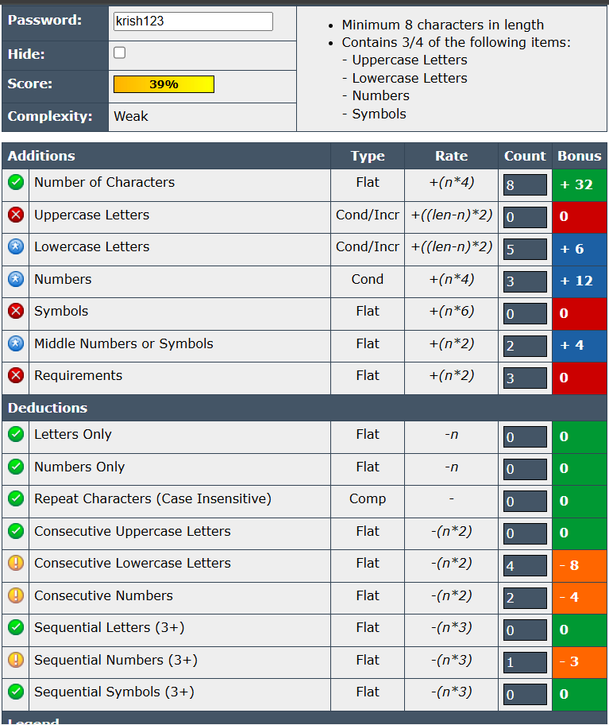
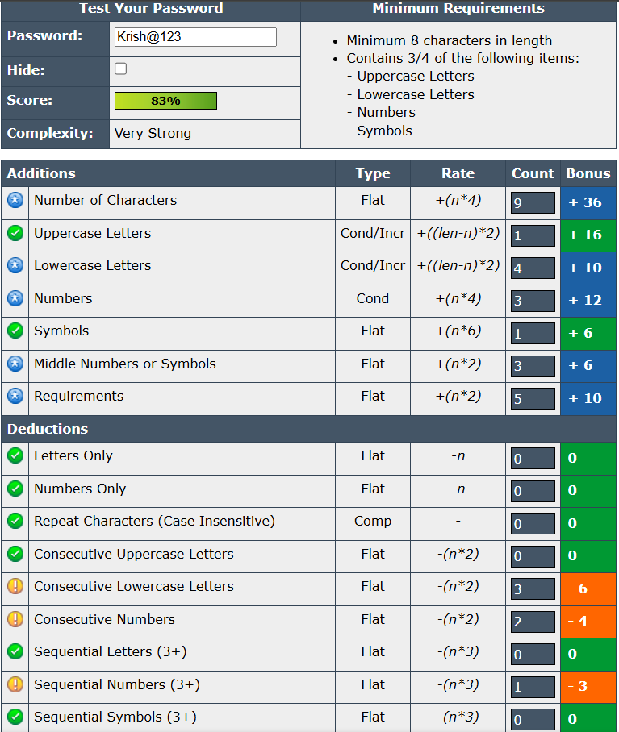
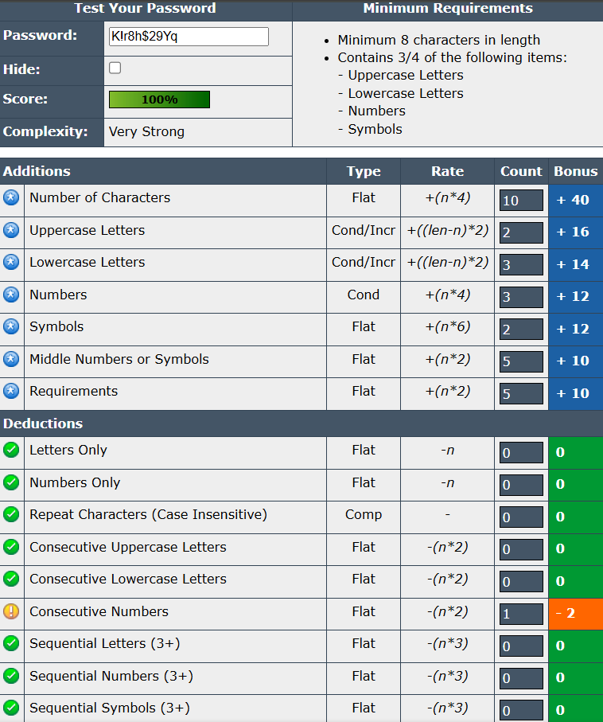

# Task 6 : Create a Strong Password and Evaluate Its Strength.

## Objective
Understand what makes a password strong and test it against password strength tools.

---

## Tools Used
- [PasswordMeter](https://www.passwordmeter.com/)

---
## Contents

### Password List

| Password      |                  Components                  |                 Strength                 |
|---------------|----------------------------------------------|------------------------------------------|
| krish123      | Lowercase + Numbers                          |Weak – short and predictable              |
| Krish@123     | Uppercase + Lowercase + Numbers + Symbol     |Medium – better, but still common pattern |
| K!r8h$29Yq    | Mixed case + Symbols + Numbers               |Strong – random and complex               |
| >rM,6$Ai?p4   | Fully random, 12 characters                  |Very Strong – secure against brute-force  |

### Test on passwordmeter.com
- krish123

- Krish@123

- K!r8h$29Yq

- >rM,6$Ai?p4

### Tips learned from the evaluation: 
 1. **Avoid common patterns like names followed by numbers (e.g., krish123)** — they are easy to guess and vulnerable to dictionary attacks
 2.	**Include a mix of uppercase, lowercase, numbers, and symbols** to increase password complexity and resistance to brute-force attacks.
 3.	**Longer passwords (12+ characters)** are significantly more secure, especially when combined with randomness.
 4.	**Avoid predictable substitutions (e.g., @ for a, 1 for l)** as attackers often account for these in their cracking tools.
 5.	**Use random sequences of characters** instead of meaningful words or phrases to increase entropy.
 6.	**Never reuse passwords** across multiple accounts; use a password manager to keep track.
 7.	**Update weak or old passwords regularly**, especially if any breach is suspected.

### Few Common Password Attacks: 
 1. **Brute Force Attack**
    - **Description:** Tries every possible combination of characters until the correct password is found.
    - **Defence:** Use long, complex, and random passwords. Enable account lockout policies or CAPTCHA after several failed attempts.

 2. **Dictionary Attack**
    - **Description:** Uses a list of common words and phrases (a "dictionary") to guess passwords.
    - **Defence:** Avoid using real words, names, or common phrases. Use a mix of character types.
 3. **Phishing**
    - **Description:** Trick users into giving up passwords via fake emails, websites, or messages.
    - **Defence:** UsAlways check the URL before entering credentials. Enable multi-factor authentication.
 4. **Keylogging**
    - **Description:** Malware records keystrokes to capture usernames and passwords.
    - **Defence:** Use up-to-date antivirus software and avoid installing unknown programs.
 5. **Rainbow Table Attack**
    - **Description:** Uses precomputed tables of hashed passwords to reverse known hash values.
    - **Defence:** Use salted hashes (random data added to passwords before hashing) and strong hashing algorithms.

### SUMMARY
Password complexity greatly enhances security by making it significantly harder for attackers to guess or crack passwords using methods like brute force or dictionary attacks. Complex passwords that include a mix of uppercase and lowercase letters, numbers, symbols, and increased length create a vast number of possible combinations, increasing the time and computing power needed to break them.
Key Takeaways:
   - Longer and more random passwords are harder to crack.
   - Including symbols and varying character types increases entropy and reduces predictability.
   - Avoiding common patterns (like "123", names, or simple substitutions) prevents easy dictionary-based attacks.
   - Strong passwords effectively defend against most automated and manual attack techniques.