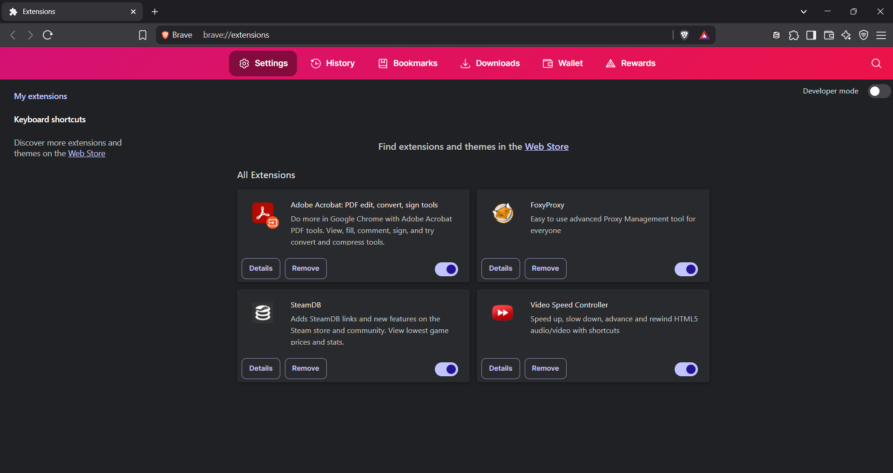
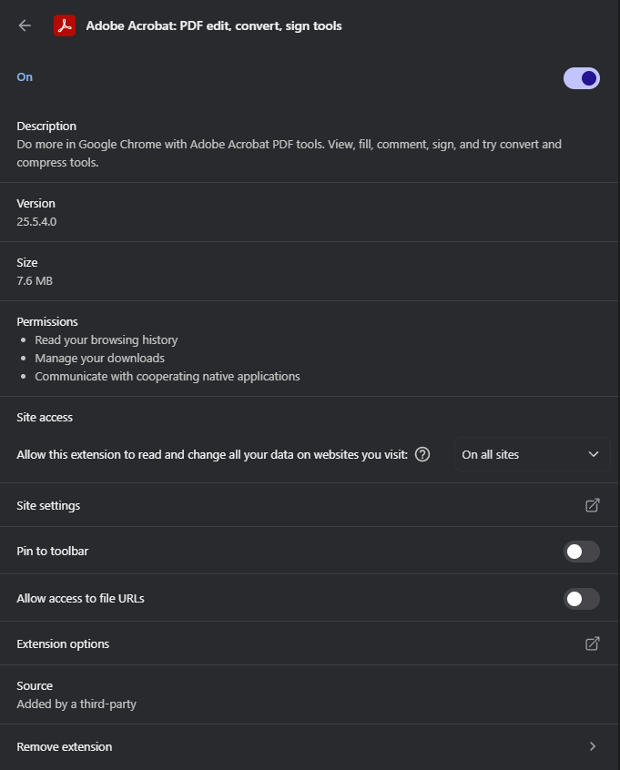
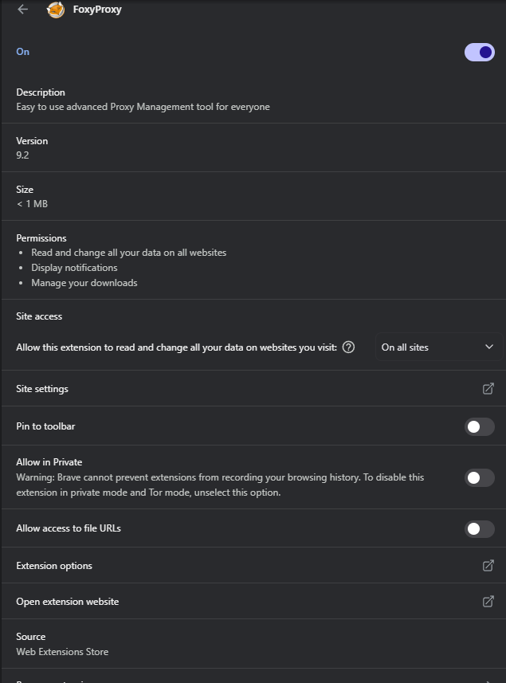
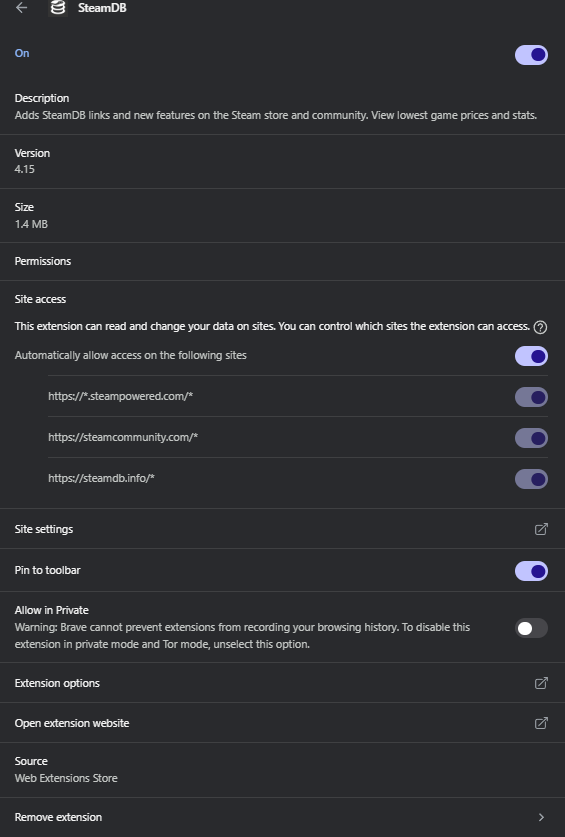
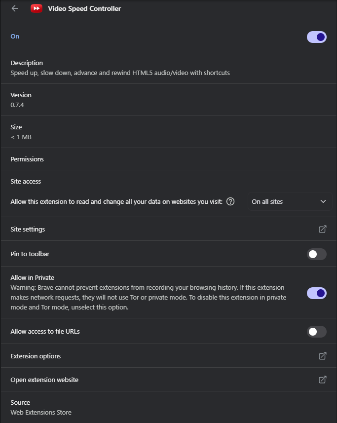

# Task 6 : Create a Strong Password and Evaluate Its Strength.

## Objective
Learn to spot and remove potentially harmful browser extensions.

---

## Tools Used
- [BraveBrowser](https://brave.com/)

---
## Contents

### EXTENSION LIST

- **Adobe Acrobat: PDF edit, convert, sign tools**
- **FoxyProxy**
- **SteamDB**
- **Video Speed Controller**

### Adobe Acrobat: PDF edit, convert, sign tools

- **Version:** 25.5.4.0
- **Size:** 7.6 MB
- **Permissions:**
   - Read your browsing history
   - Manage your downloads
   - Communicate with cooperating native applications
   
### FoxyProxy

- **Description:** Easy to use advanced Proxy Management tool for everyone
- **Version:** 9.2
- **Size:** < 1 MB
- **Permissions:**
   - Read and change all your data on all websites
   - Display notifications
   - Manage your downloads

### SteamDB

- **Description:** Adds SteamDB links and new features on the Steam store and community. View lowest game prices and stats.
- **Version:** 4.15
- **Size:** 1.4 MB
- **Permissions:** None
- **Site Access:**
   - https://*.steampowered.com/*
   - https://steamcommunity.com/*
   - https://steamdb.info/*

### Video Speed Controller

- **Description:** Speed up, slow down, advance and rewind HTML5 audio/video with shortcuts.
- **Version:** : 0.7.4
- **Size:** < 1 MB
- **Permissions:** None
- **Site Access:** All

---
### Extensions Reviewed 

| Extension Name         |                              Permissions Summary                         |          Verdict          |
|------------------------|--------------------------------------------------------------------------|---------------------------|
| Adobe Acrobat          | Browsing history, download management, native app communication          |Safe – Trusted             |
| FoxyProxy              | Full access to all website data, downloads, notifications                |Safe – Used for BurpSuite  |
| SteamDB                | No special permissions, limited site access to Steam-related domains     |Safe – Trusted             |
| Video Speed Controller | No special permissions, access to all sites (typical for video controls) |Safe – Popular Tool        |

---
### Action Taken 
 - Reviewed all installed browser extensions.
 - Checked permissions, purpose, and user reviews.
 - **No suspicious or unused extensions found.**
 - **FoxyProxy** is configured specifically for use with **BurpSuite** during security testing.

---
### How malicious extensions can harm users
 - **Data Theft:** Steal passwords, cookies, and personal info by reading web page content.
 - **Spy Activity:** Track browsing behavior and send data to attackers.
 - **Ad Injection:** Display unwanted ads or redirect to malicious websites.
 - **Credential Harvesting:** Fake login forms or keyloggers to capture credentials.
 - **System Access:** Exploit permissions to download files or run code.
 - **Man-in-the-Browser Attacks:** Modify web pages in real-time (e.g., changing payment details).