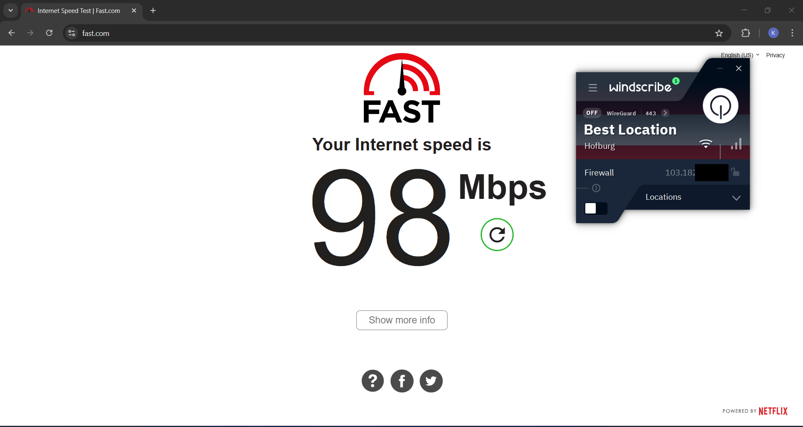
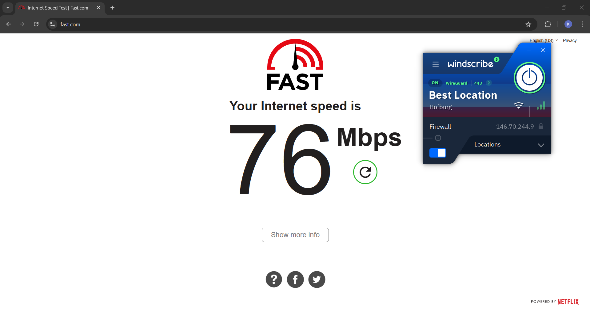
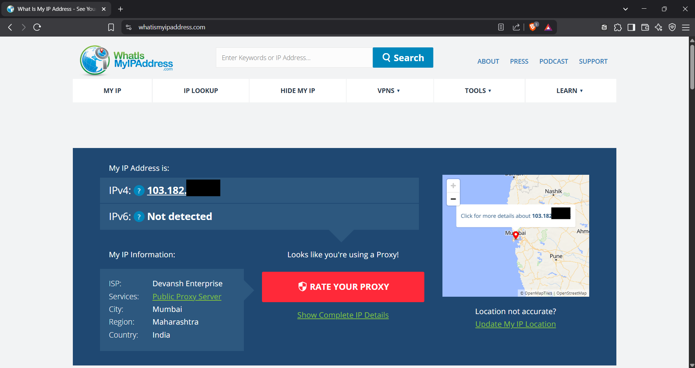
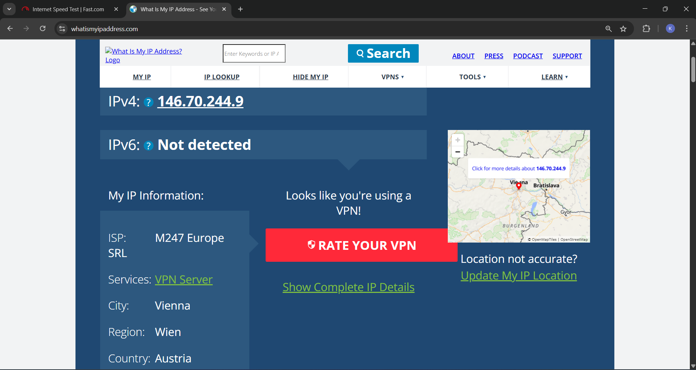
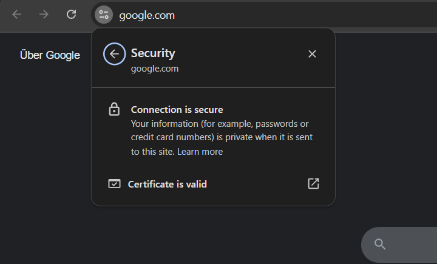

# Task 8 : Working and understanding VPN.

## Objective
Understand the role of VPNs in protecting privacy and secure communication.

---

## Tools Used
- [WindScribeVPN](https://windscribe.com/)
- [SpeedTest](https://fast.com/)
- [WhatIsMyIpAddress](https://whatismyipaddress.com/)

---
## Content

### Speed Test Before VPN Connection

---
### Speed Test After VPN Connection

---
### IP Before VPN Connection

---
### IP After VPN Connection

---
### Encryption Status After Connecting VPN

---
### VPN encryption and privacy features 

1.	**Encryption Protocols:** VPNs use strong encryption protocols to secure your internet traffic. Common ones include:
   - OpenVPN – Open-source, highly secure, and widely supported.
   - WireGuard – Fast, modern, and lightweight protocol.
   - IKEv2/IPSec – Stable and good for mobile devices.
   - L2TP/IPSec – Older, slower, but still encrypted.

2.	**Data Encryption:** VPNs encrypt data using AES-256, the same standard used by governments and banks. It ensures:
   - Confidentiality of online activity.
   - Protection from hackers, ISPs, and surveillance.

3.	**IP Masking:** VPN hides your real IP address and assigns you a new one, protecting your identity and making it hard to track your location or online behaviour.

4.	**DNS Leak Protection:** Prevents your DNS requests from leaking outside the VPN tunnel, ensuring no accidental exposure of visited websites.

5.	**Kill Switch:** A safety feature that automatically disconnects your internet if the VPN connection drops, preventing data leaks.

6.	**Split Tunnelling:** Lets you choose which apps or websites go through the VPN and which don’t—balancing privacy and speed.

7.	**Obfuscation:** Some VPNs offer obfuscated servers to hide the fact you’re using a VPN, useful in restrictive environments (e.g., school networks, censored countries).

---
### Benefits of Using VPN 
 - **Hides Real IP Address:** Prevents websites and trackers from identifying actual location.
 - **Encrypted Traffic:** Secures data even on public Wi-Fi.
 - **Bypasses Geo-restrictions:** Allows access to region-locked content.
 - **Built-in Firewall and Ad-blocker (Like R.O.B.E.R.T. in Windscribe):** Adds extra security and privacy.

---
### Limitations Observed
 - **Speed Reduction:** Slightly slower internet speed when connected.
 - **Data Cap:** 10 GB/month (for free users, with email verification).
 - **Some Services blocks VPN Traffic.**
